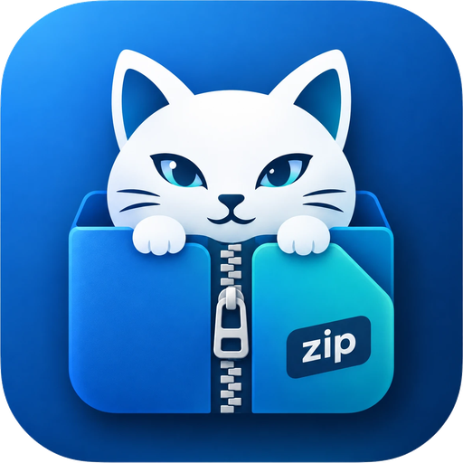

# smarcivaZIP

**Lhaplus の使い心地のまま、2026 年の書庫に対応した圧縮・解凍ソフト。**

ダブルクリックで解凍。右クリックで形式を選んで圧縮。それだけ。
設定画面はありますが、開かなくても困らないようにしてあります。

[](LICENSE)

---

## なぜ作ったのか

Lhaplus は 2000 年代の Windows で定番だった圧縮解凍ソフトで、
「余計なことをしない」という一点で今でも使われ続けています。

ただ、最後の更新が 2015 年で止まっているため、現代の書庫ではつらい場面が増えました。

| | Lhaplus 1.74 | smarcivaZIP |
|---|---|---|
| RAR5 (RAR 5.0) | 非対応 | **対応**（展開のみ） |
| Zstandard / XZ / LZ4 | 非対応 | **対応** |
| ZIP の AES 暗号化 | 非対応（ZipCrypto のみ） | **対応（AES-256）** |
| 海外製 ZIP の文字化け | CP932 決め打ちで破綻 | **自動判定＋手動切替＋プレビュー** |
| macOS 製 ZIP の濁点分解 | そのまま（「ガ」が崩れる） | **NFC に正規化** |
| `__MACOSX` / `._*` / `.DS_Store` | そのまま展開 | **自動で除外** |
| Zip Slip・Zip Bomb | 無防備 | **検出してブロック** |
| 260 文字を超えるパス | 失敗 | **対応** |
| 64bit / ARM64 | 32bit のみ | **x64 / arm64 ネイティブ** |

---

## 文字化けについて

これが smarcivaZIP の主目的です。

ZIP はファイル名の文字コードを記録していません
（UTF-8 であることを示すフラグが立っている場合を除く）。
そのため展開する側が推測するしかなく、外れると文字化けします。

smarcivaZIP は次の 3 段階で判定します。

1. **デコードできるか** — そのコードページで表現できないバイト列があれば除外
2. **文字種が自然か** — ファイル名として出てくるはずのない文字が並んでいないか
3. **バイト列が常用領域に収まっているか** — ここが効きます

3 が無いと、日本語と韓国語を取り違えます。
CP932 の日本語をうっかり CP949 で読むと、一応ハングルに「なってしまう」からです。
ただしそのハングルは常用外の領域に散らばるので、
本物の韓国語（EUC-KR の完成型常用領域 `0xB0A1`–`0xC8FE` にほぼ収まる）とは区別できます。

判定に自信があるときは何も聞かずに展開します。
迷ったときだけ、展開前にファイル名の一覧を見せて選ばせます。

対応コードページ: UTF-8 / CP932 (Shift_JIS) / CP936 (GBK) / CP950 (Big5) /
CP949 (EUC-KR) / CP866 / Windows-1252 / CP437

---

## macOS で作られた書庫について

macOS はファイル名を **NFD** で保存します。
「ガ」は 1 文字ではなく「カ」＋「濁点」として記録されるため、
そのまま Windows に展開すると見た目が崩れ、検索にも引っかからなくなります。

smarcivaZIP は展開時に **NFC へ正規化**し、
ついでに `__MACOSX/`・`._*`（リソースフォーク）・`.DS_Store` を取り除きます。

DMG（HFS+ / 一部 APFS）もそのまま開けます。

---

## 表示言語

20 言語に対応しています。既定では Windows の表示言語に合わせ、
対応していない言語のときは英語になります。設定画面の「設定」タブで固定もできます。

English / 简体中文 / 繁體中文 / Español / العربية / Português / Bahasa Indonesia /
Français / 日本語 / Русский / Deutsch / 한국어 / Türkçe / Italiano / Tiếng Việt /
Polski / ไทย / Nederlands / Українська / हिन्दी

この 20 言語で、インターネット利用者のおおよそ 9 割に母語か第二言語で届きます。
上位 10 言語ほどで 8 割に達し、そこから先は 1 言語あたりの上積みが急に小さくなるため、
地域方言までは追わずここで止めています。

アラビア語では画面全体を右から左に反転します。ボタンの並びや文字の寄せだけでなく、
文中に混ざる数字やラテン文字の位置も変わるためです。
タイ語・ヒンディー語・アラビア語の字形は Windows 10 以降に標準で入っている
Nirmala UI / Leelawadee UI / Segoe UI から拾います（フォントの追加導入は不要です）。

表示言語は文字コードの判定にも効きます。ZIP のファイル名は判定が割れることがあり、
そのときは利用者の言語圏を優先するのが最も当たるためです
（韓国語環境なら CP949、簡体字中国語環境なら CP936 が優先されます）。

### 翻訳を追加したい方へ

`src/SmarcivaZip.Core/Resources/Strings.resx`（英語・既定）をコピーして
`Strings.<言語コード>.resx` を作り、`<value>` を訳してください。
キーは変更しないでください。

訳を追加したら `src/SmarcivaZip.Core/Localization/AppLanguage.cs` の
`Available` に 1 行足せば、設定画面の一覧に出ます。

テストがキーの過不足と書式指定子（`{0}` など）のずれを検出するので、
`dotnet test` が通れば取り込みの準備はできています。

一覧に載せるのは訳が揃った言語だけにしています。選べるのに中身が未翻訳、
という状態が利用者にとって一番困るためです。

---

## 対応形式

実際に使える形式は同梱している `7z.dll` の対応状況で決まります。
起動時に DLL へ問い合わせて一覧を作るので、設定画面の「情報」タブで実際の対応状況を確認できます。

**解凍**: 7z, ZIP, ZIPX, RAR, RAR5, TAR, GZ, BZ2, XZ, ZST, LZH/LHA, CAB, ARJ, Z,
ISO, DMG, HFS+, MSI, CHM, NSIS, WIM, CPIO, RPM, DEB, XAR, SquashFS,
VHD/VHDX/VMDK/VDI, FAT/NTFS/EXT, UDF ほか

**圧縮**: ZIP, ZIP（AES-256）, 7z, 7z（AES-256＋ヘッダ暗号化）, TAR, TAR.GZ, TAR.XZ, TAR.ZST, GZ, XZ

RAR 形式での圧縮は行いません（unRAR のライセンス制限のため）。

---

## アイコン

アプリ本体と書庫ファイルで形を変えています。同じ絵にすると、同じフォルダに並んだときに
どれが実行ファイルか分からなくなるためです。

- **アプリ** — 塗りつぶした角丸タイル
- **書庫** — 紙の形（右上が折れている）＋ 下帯に形式名

形式の区別は色に持たせています。エクスプローラーの詳細表示は 16px で、
その大きさでは何を書いても文字は読めません。隅に小さくラベルを置く方式は
48px 以上でしか機能しないので、16px で効く手掛かりは色と輪郭だけです。

| 分類 | 色 | 拡張子 |
|---|---|---|
| ZIP | 青 | zip, zipx, jar |
| 7z | 緑 | 7z |
| RAR | 紫 | rar, r00 |
| TAR | 橙 | tar, tgz, tbz, txz, tzst |
| 圧縮ファイル | 灰青 | gz, bz2, xz, zst, lzma, lz4, z |
| LZH | 赤 | lzh, lha |
| アーカイブ | 紺 | cab, arj, iso, dmg ほか |

アイコンは `DefaultIcon` が ProgID 単位でしか設定できないため、分類ごとに
ProgID を分けています（`smarcivaZIP.Zip` など）。
`.ico` は exe に埋め込まず隣の `Icons` フォルダに置いてあるので、差し替えられます。

---

## 安全性

書庫の中身は、他人が自由に決められるデータです。そのつもりで扱っています。

- **Zip Slip** — `../` や絶対パスで展開先の外に書き込もうとするエントリを拒否
- **Zip Bomb** — 展開後サイズ・圧縮率・エントリ数を見て、異常なら確認を出す
- **シンボリックリンク** — 既定では展開しない（リンク経由の脱出を防ぐため）
- **予約デバイス名** — `CON` `NUL` `COM1` などは末尾に `_` を付けて回避
- **代替データストリーム** — ファイル名中の `:` を無害化
- **Mark of the Web** — インターネット由来の印を展開後のファイルへ引き継ぐ

最後の項目は地味ですが重要で、
これが無いと「ZIP に入れるだけで SmartScreen を回避できる」という穴になります。

---

## インストール

[Releases](https://github.com/comnote-max/smarcivaZIP/releases) から、
どちらかの形でどうぞ。

| ファイル | サイズ | 向いている人 |
|---|---|---|
| `smarcivaZIP-<ver>-setup-x64.exe` | 約 54 MB | ふつうはこれ。インストーラ |
| `smarcivaZIP-<ver>-win-x64.zip` | 約 53 MB | 好きな場所に置いて使いたい（ポータブル） |
| `smarcivaZIP-<ver>-win-x64-runtime-required.zip` | 約 2 MB | [.NET 9 Desktop Runtime](https://dotnet.microsoft.com/download/dotnet/9.0) を入れてある |

ARM 版の Windows では `arm64` の付いた方を使ってください。

### インストーラ

使用許諾に同意して「次へ」を押していくだけです。**管理者権限は要りません**
（`%LOCALAPPDATA%\Programs\smarcivaZIP` に、使っている人の分だけ入ります）。
右クリックメニューと関連付けはインストールの最後に登録されます。
途中の「右クリックメニューと関連付けを登録する」を外せば、登録せずに入れることもできます。

入れ直すと上書き更新になり、設定はそのまま引き継がれます。

> **「Windows によって PC が保護されました」と出たら**
> コード署名をしていないため、SmartScreen が警告を出します。
> 「詳細情報」→「実行」で進めます。心配な場合は、Releases の `SHA256SUMS.txt` と
> ダウンロードしたファイルのハッシュが一致するか確かめてください。

サイレントインストールもできます（配布や自動化向け）。

```
smarcivaZIP-<ver>-setup-x64.exe /VERYSILENT /SUPPRESSMSGBOXES
smarcivaZIP-<ver>-setup-x64.exe /VERYSILENT /MERGETASKS="!shellintegration"   ← 右クリックメニューを登録しない
```

### ポータブル版（ZIP）

好きな場所に展開して `SmarcivaZip.exe` を起動し、
「設定」タブの **登録する** を押してください。管理者権限は不要です。

### Windows 11 での注意

右クリックメニューは「その他のオプションを確認」の中に入ります。
第一階層に出すには MSIX パッケージ化とコード署名証明書が必要なため、v2 の課題としています。

`.zip` のように既に他のアプリが握っている拡張子は、
Windows の「既定のアプリ」で選び直す必要があります（設定画面にボタンがあります）。

### アンインストール

**インストーラで入れた場合**：Windows の「設定」→「アプリ」→「インストールされているアプリ」から
smarcivaZIP をアンインストールしてください。右クリックメニューと関連付けも消えます。
最後に「設定も削除しますか？」と聞かれます（既定は残す）。

関連付けは、設定画面に載っている拡張子だけでなく、smarcivaZIP を指している登録を
レジストリから総当たりで探して消します。途中でチェックを外した拡張子も取り残しません。
他のアプリの関連付け（Lhaplus や Windows 標準の ZIP など）には触りません。

**ポータブル版の場合**：設定画面の **解除する** を押してから、フォルダごと削除してください。

どちらの場合も、レジストリは `HKEY_CURRENT_USER\Software\Classes` の下しか触りません。
設定ファイルは `%APPDATA%\smarcivaZIP\` にあります。

---

## 使い方

| 操作 | 動作 |
|---|---|
| 書庫をダブルクリック | 同じ場所に解凍 |
| 右クリック → smarcivaZIP → ○○ に圧縮 | その形式で圧縮 |
| 右クリック → smarcivaZIP → ○○ に圧縮（パスワード） | パスワードを聞いてから圧縮 |
| 右クリック → smarcivaZIP → ここに解凍 | フォルダを作らず解凍 |
| 右クリック → smarcivaZIP → フォルダを作って解凍 | 必ずフォルダを作って解凍 |
| 右クリック → smarcivaZIP → 文字コードを選んで解凍 | プレビューを見てから解凍 |

複数のファイルを選んで圧縮すると、ひとつの書庫にまとまります。

右クリックメニューに並べる圧縮形式は、設定画面の「圧縮」タブで選べます。
並び順もそのまま反映されます。

### コマンドライン

```
SmarcivaZip.exe <アーカイブ>                     解凍する
SmarcivaZip.exe --extract-to-folder <アーカイブ>  フォルダを作って解凍する
SmarcivaZip.exe --extract-preview <アーカイブ>    文字コードを確認してから解凍する
SmarcivaZip.exe --compress zip <パス...>          ZIP に圧縮する
SmarcivaZip.exe --compress 7z --password <パス...> パスワード付きで圧縮する
SmarcivaZip.exe --settings                        設定画面を開く
SmarcivaZip.exe --register / --unregister         関連付けの登録・解除
                          --quiet を付けると、完了のダイアログを出さず終了コードだけで返す
```

---

## ビルド

必要なもの: .NET 9 SDK、Windows 10 1809 以降

```powershell
# 7z.dll を 7-zip.org から取得する（native/ に置かれる。リポジトリには含まれない）
./tools/fetch-7zip.ps1

# テストを回して、配布用の ZIP とインストーラを作る
./tools/build.ps1
```

インストーラの作成には [Inno Setup 6](https://jrsoftware.org/isinfo.php) が要ります
（`winget install JRSoftware.InnoSetup`）。無ければ警告を出して ZIP だけ作ります。
定義は `installer/smarcivaZIP.iss`、インストール時に表示する使用許諾は
`installer/license/` にあります。

開発中は普通に `dotnet build` / `dotnet test` で動きます。

アイコンの元絵を差し替えたときは、`.ico` を作り直してください
（Pillow が必要です。ふだんのビルドでは実行されません）。

```powershell
python tools/make-icons.py
```

### テスト用の書庫について

RAR は unRAR のライセンス上こちらで作れないため、WinRAR で作った小さな書庫を
`src/SmarcivaZip.Tests/Fixtures/` にコミットしてあります。

LZH は作れるツールが手元に無いので、仕様どおりにバイト列を組む
`tools/make-lzh-fixture.py` で生成しています。ヘッダのチェックサムと
データの CRC-16 を 7-Zip が検証するため、読めた時点で構造は正しいと言えます。

```powershell
python tools/make-lzh-fixture.py src/SmarcivaZip.Tests/Fixtures/lzh-cp932.lzh
```

### 構成

```
src/
  SmarcivaZip.Core/     7z.dll の相互運用、文字コード判定、安全性、展開・圧縮
    SevenZip/           COM インターフェイスと専用ワーカースレッド
    Localization/       表示言語と文字列リソース
    Resources/          Strings.resx（英語・中立）と各言語の Strings.<言語コード>.resx
    Encodings/          コードページ判定、ZIP セントラルディレクトリ解析、NFC 正規化
    Safety/             パスのサニタイズ、Zip Bomb 検出、Mark of the Web
    Extraction/         展開
    Compression/        圧縮
    Shell/              関連付け、右クリックメニュー、複数選択の集約
    Settings/           設定、ログ
  SmarcivaZip.App/      WPF の画面
    Assets/             アイコン（.ico は tools/make-icon.py で生成）
  SmarcivaZip.Tests/    テスト
installer/              インストーラ（Inno Setup）と、表示する使用許諾
tools/                  ビルド、7z.dll の取得、アイコン生成
```

詳しい仕様は [docs/SPEC.md](docs/SPEC.md) にあります。

---

## リンク

- 配布元: <https://smarciva.com/>
- リポジトリ: <https://github.com/comnote-max/smarcivaZIP>

---

## ライセンス

smarcivaZIP 本体は [MIT License](LICENSE) です。
**無保証**で提供され、使用によって生じた損害について作者は責任を負いません
（インストール時にも同じ内容を表示し、同意を得ています）。

同梱している `7z.dll` は 7-Zip（Igor Pavlov 氏）のもので、**LGPL-2.1 以降**が適用されます。
動的リンクで利用しているだけなので、利用者は同じフォルダの `7z.dll` を
差し替えることができます。

RAR の展開部分は unRAR のコードに由来し、
**RAR 互換のアーカイバを開発する目的には使用できません**。
詳細は [THIRD-PARTY-NOTICES.md](THIRD-PARTY-NOTICES.md) を参照してください。

---

## 貢献

不具合報告・提案は Issue へ。文字化けの誤判定を見つけた場合は、
可能であれば再現する書庫（中身は差し支えない範囲で）を添えてもらえると助かります。
判定ロジックのテストは `src/SmarcivaZip.Tests/EncodingDetectorTests.cs` にあります。

何か落ちた場合、`%APPDATA%\smarcivaZIP\smarcivazip.log` に記録が残ります。
